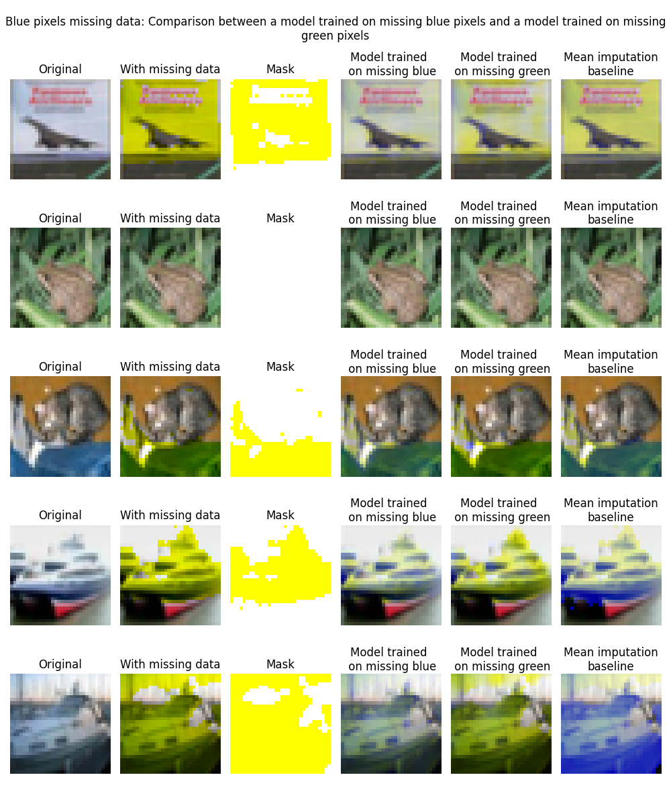

# MVA_PGM_NotMIWAE

## Overview

This project was made for the course Probabilistic Graphical Models and Deep Generative Networks at the master Mathématiques, Vision, Apprentissage (MVA)
This project was made by Gabrielle Caillaud, Damien Bouet, Emilien Biré.

This project was made on the notMiwae [article](https://arxiv.org/abs/2006.12871) : Ipsen, N. B., Mattei, P. A., & Frellsen, J. (2020). not-MIWAE: Deep generative modelling with missing not at random data. arXiv preprint arXiv:2006.12871.

## Installation

You can install the required libraries by running ``pip install -r requirements.txt``

## Organization of the code

As presented in our report, we tackle two types of experiments.
1. Experiments related to the UCI Breast Cancer dataset. The code we developped to make our requirements can be found in the `code/code_UCI_experiments/` folder.
2. Experiments on the CIFAR-10 dataset. The code we developped for this experiments can be found in `code/code_CIFAR_experiments`

```
├───code
│   ├───code_CIFAR_experiments
│       ├───__init__.py
│       ├───baselines.py
│       ├───model.py
│       ├───plot.py
│       ├───train.py
│       ├───transforms.py        
│   ├───code_UCI_experiments
│       ├───__init__.py 
│       ├───introduce_missing_data.py 
│       ├───miwae.py 
│       ├───not_miwae.py 
│       ├───run_baselines.py 
│       ├───train.py 
│   ├───common
│       ├───__init__.py
│       ├───data_imputation.py
│       ├───utils.py
│   ├───__init__.py
│   ├───run.batch
├───datasets
│   ├───cancer-dataset
├───demo_CIFAR_experiments.txt
├───demo_UCI_experiments.txt
├───project_report.pdf
├───README.md
├───Requirements.txt


```
In addition of the source code, we wrote two files that provide the reader an easy way to reproduce some results:
`demo_CIFAR_experiments.py` and `demo_UCI_experiments.ipynb`
The demo for the experiments on CIFAR is a python script and not a notebook, because we did all experiments on CIFAR using a GPU and we are not able to run a notebook on our GPU.

### Results on the CIFAR-10 dataset
Here are our results on the CIFAR-10 dataset. More information is provided in the [project report](project_report.pdf)



